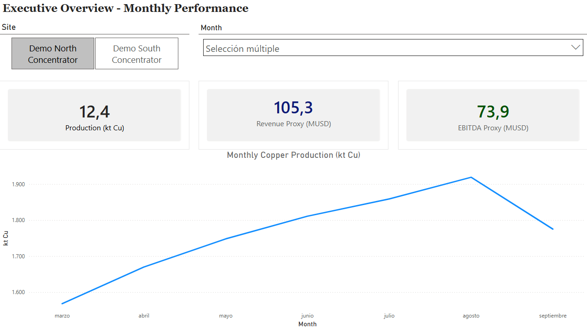
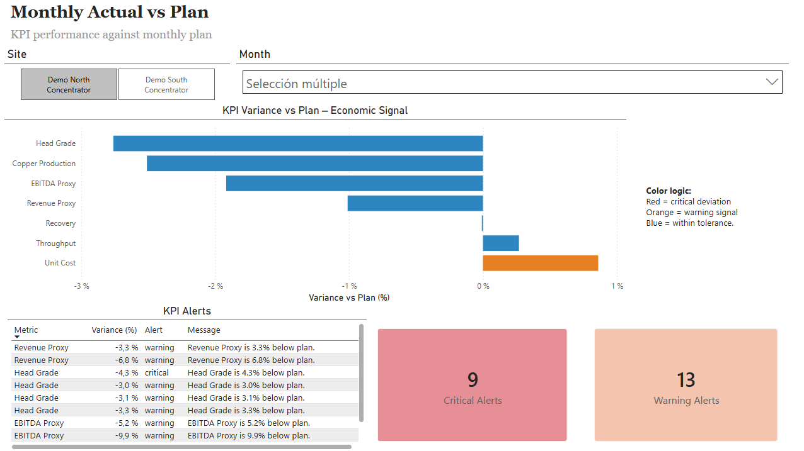
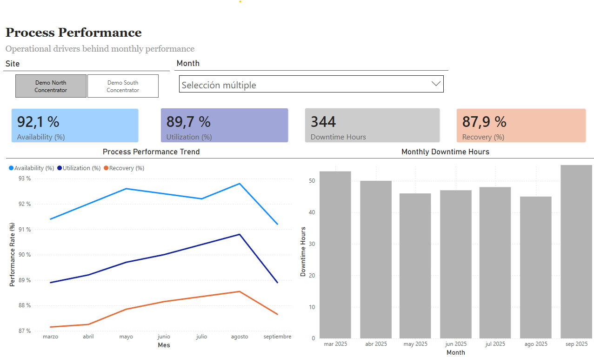
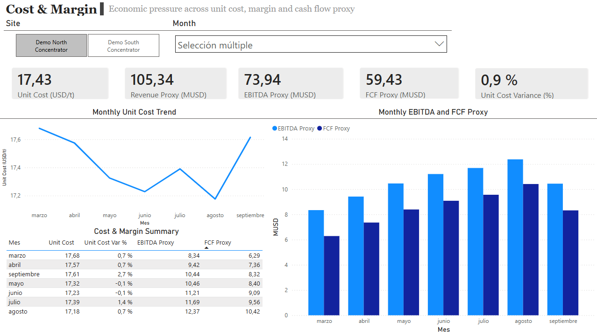
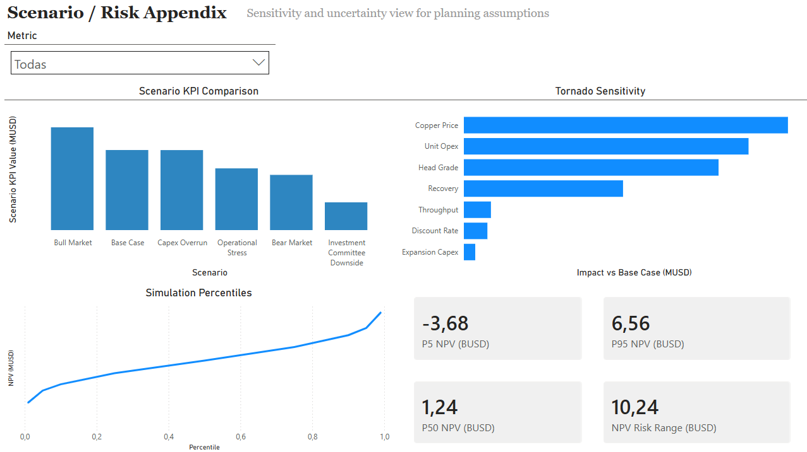

# Copper Mining Monitoring BI

Public-safe mining performance monitoring built as a reproducible Python-to-Power-BI workflow.

This repository packages monthly actual-vs-plan control, KPI alerting, operational driver analysis, cost and margin pressure monitoring, and a secondary scenario/risk appendix for a hypothetical copper operation.

The main deliverable is not just a Power BI file.

The main deliverable is a reproducible analytical workflow:

```text
Python pipeline
  -> validated canonical monthly and annual demo datasets
  -> BI-ready outputs under outputs/bi
  -> Power BI starter kit and PBIP/TMDL-oriented handoff
  -> manually finalized public-safe dashboard in Power BI Desktop
```

## Problem Statement

Mining dashboards are often shown as isolated BI files with little clarity on:

- where the data comes from
- how metrics are defined
- how monthly actual-vs-plan logic is reproduced
- how scenario or risk context is separated from the core management story

This project addresses that gap by combining:

- a Python pipeline for reproducible monthly monitoring datasets
- BI-ready marts and semantic support tables
- a Power BI handoff structure that is honest about what is automated and what is manually finalized in Desktop

## What This Project Demonstrates

- monthly actual-vs-plan performance control
- KPI alerting and economic signal classification
- process-driver explanation for production and downtime
- cost-center and margin-pressure monitoring
- a secondary scenario / risk appendix with tornado sensitivity and simulation percentiles

## Dashboard Story

The locally finalized Power BI dashboard contains five pages:

1. Executive Overview
2. Monthly Actual vs Plan
3. Process Performance
4. Cost & Margin
5. Scenario / Risk Appendix

Pages 1 to 4 are the primary product story.

Page 5 is intentionally secondary.

## Screenshot Assets

Expected screenshot files live under `docs/assets/powerbi/`.

Place the final public-safe images there with these exact filenames:

| Dashboard page | Expected file |
| --- | --- |
| Executive Overview | `docs/assets/powerbi/executive_overview.png` |
| Monthly Actual vs Plan | `docs/assets/powerbi/monthly_actual_vs_plan.png` |
| Process Performance | `docs/assets/powerbi/process_performance.png` |
| Cost & Margin | `docs/assets/powerbi/cost_margin.png` |
| Scenario / Risk Appendix | `docs/assets/powerbi/scenario_risk_appendix.png` |

If the PNG files are not in the repo yet, see `docs/assets/powerbi/README.md` for exact placement instructions.

### Executive Overview



### Monthly Actual vs Plan



### Process Performance



### Cost & Margin



### Scenario / Risk Appendix



## Architecture

### Monthly monitoring core

Public-safe demo data from `data/sample_data/monthly_monitoring/` feeds the core monthly monitoring pipeline:

- throughput
- head grade
- recovery
- copper production
- unit cost
- revenue proxy
- EBITDA proxy
- operating cash flow proxy
- free cash flow proxy

### BI-ready outputs

The pipeline writes reusable outputs to `outputs/bi/`, including:

- `kpi_monthly_summary.csv`
- `fact_monthly_actual_vs_plan.csv`
- `mart_monthly_executive_overview.csv`
- `mart_monthly_process_performance.csv`
- `mart_monthly_cost_margin.csv`
- `mart_monthly_by_site.csv`
- `mart_process_driver_summary.csv`
- `mart_cost_center_summary.csv`
- Power BI relationship, query, measure, sort-by, and field-visibility catalogs

### Power BI handoff

The repo includes:

- `powerbi/template_scaffold/`
- `powerbi/pbip_tmdl_scaffold/`
- `powerbi/START_HERE.md`

These assets automate the dataset and semantic handoff.

They do **not** claim to automatically generate the final finished Power BI canvas.

The final PBIX was manually finalized in Power BI Desktop.

## Data Reality

This repository is public-safe and sample-data based.

It does not include:

- private company data
- ERP-connected actuals
- historian or telemetry integration
- private local profiles
- private mapping files

The monthly financial fields are planning/control proxies, not audited financial statements.

## Reproducibility

Install dependencies:

```bash
python -m pip install -e .[dev]
```

Build the main BI-ready outputs:

```bash
python scripts/build_bi_dataset.py
```

Run the public demo profile end to end:

```bash
python scripts/run_local_profile.py --profile config/source_profiles/public_demo_profile.yaml --scope all
```

Run tests:

```bash
python -m pytest -q
```

## Power BI Dashboard Documentation

Start here for the dashboard story:

- `docs/dashboard/POWER_BI_DASHBOARD.md`
- `powerbi/START_HERE.md`
- `powerbi/TEMPLATE_LAYER.md`
- `powerbi/pbip_tmdl_scaffold/README.md`

## Public-Safe / Private Adaptation Pattern

Public version:

- uses sample/demo monthly and annual appendix datasets
- keeps the monthly monitoring layer as the main story
- exposes only public-safe outputs and documentation

Private adaptation path:

- replace demo source tables with governed local company exports
- preserve canonical schemas
- keep private source profiles and mappings in ignored local-only folders
- regenerate the same BI-ready contract without exposing private data

## Limitations

- the final dashboard canvas is manually finalized in Power BI Desktop
- the repository does not store private data or live system integrations
- financial fields are planning/control proxies, not statutory accounting numbers
- the scenario/risk appendix is intentionally secondary to the monthly control story
- the repo is stronger as a planning, control, and BI workflow than as a full mine-engineering or corporate-finance model

## Portfolio Positioning

This project should be read as a serious analytics portfolio artifact for mining planning, management control, and BI handoff.

It is meant to show:

- domain-specific KPI design
- reproducible Python data preparation
- public-safe analytical packaging
- semantic BI handoff discipline
- honest separation between automated data products and manually finalized dashboard presentation

## Recommended Review Path

1. `README.md`
2. `docs/dashboard/POWER_BI_DASHBOARD.md`
3. `powerbi/START_HERE.md`
4. `docs/MONTHLY_MONITORING_LAYER.md`
5. `outputs/bi/kpi_monthly_summary.csv`
6. `outputs/bi/fact_monthly_actual_vs_plan.csv`
7. `outputs/bi/mart_monthly_cost_margin.csv`
8. `RELEASE_V1.md`
